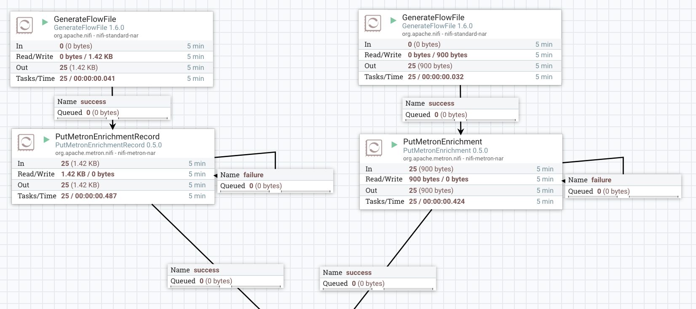
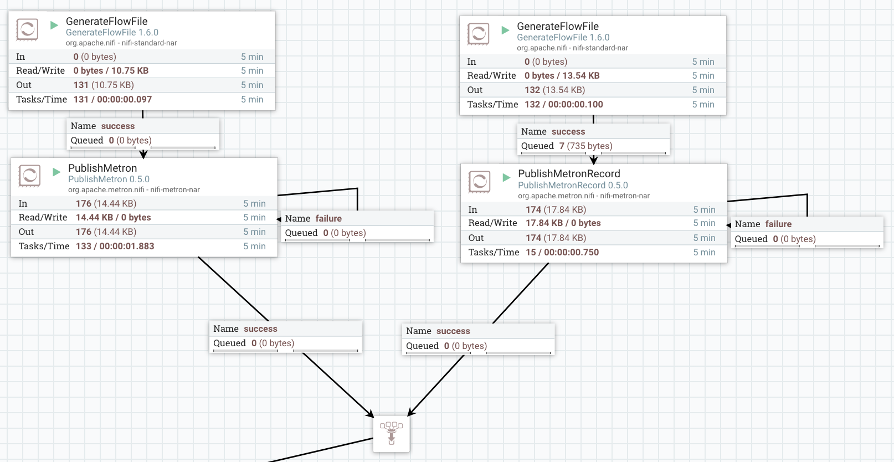

# Metron Nifi Bundle

Many implementations of Metron make use of Apache NiFi to ingest data from myriad data sources and transports and push that data into Kakfa. Apache NiFi has a wide variety of connectors and the ability to filter, prioritize, and to an extent process, data at the edge. 

This bundle presents a 'nar' or NiFi Archive File containing a number of NiFi processors which have been tailored to make working with Metron easier. 

To install this bundle, copy the nar file under nifi-metron-nar/target into the lib directory of your NiFi installation, or preferable into a custom lib location, and start your NiFi instance. The processors will be available on the canvas.

## PublishMetron

This is essentially an opinionated version of the NiFi PublishKafka processors. It is intended to predetermine some assumptions about the way that Metron uses Kafka and make it simpler to configure. For example. Metron uses the Kafka key to communicate meta data about a message and so doesn't work well with the DefaultPartitioner. This processor handles building the meta data carrying key and ensuring sensible partition balancing. 

Another key Metron assumption is that a single line of telemetry arrives as a single message in Kafka. This can currently be achieved with NiFi's various Split processors. However, we have found that there is significant overhead in this. One option is to move to the NiFi Record Processing processors, which are significantly more efficient for this sort of workload, however, in this processor we provide a quick means of delimiting messages which bypasses the need to perform a separate split operation and incur flow file overhead.

Note that there will be no need to Split any content going into this processor as it performs delimiter splitting in the stream. 

## TransformMetronStellar

Stellar is a rich transformation language which is an integral part of much of the Metron project. This processor extends the ability to use Stellar into NiFi, and can apply Stellar transformations against either content of a FlowFile (if the content is in a schema-based record, or JSON map form) or on the Attributes of the FlowFile. It can be used entirely independently of Metron. We do not however recommend using the Stellar functions which call out to Metron services at this time (Enrichments, MaaS, Profiling etc.)

## MetronParser

Sometimes it can be useful to pre-parse some data at the edge of an infrastructure. While this is very much not intended for massive scale parsing, this processor allows the embedding of Metron Parsers into a NiFi processor. This allows a consistent approach to collecting data at the edge. Note that data is parsed into a Metron JSON object, so data received on the Metron-side Kafka topic need not be further parsed, and can be pushed directly into enrichment. However, a Noop Parser in Metron itself is a good idea, since further transformations, or application of meta data such as the source of the message can be necessary in the core instance, so it is not recommended to bypass the core parsing step. Instead, use the Noop Parser class, and apply whatever transformations are required to add in meta data. 

This processor actually uses the NiFi record reader mechanisms, which the Metron derived parser being responsible for reading the records, based on a delimiting pattern.

## PutMetronEnrichment

## PutMetronEnrichmentRecord

A record services enabled version of the PutMetronEnrichment processor, designed to take record oriented data and push as a batch of enrichments into Metron.  

## Example Flows: Enrichment

## Example Flows: Publication

